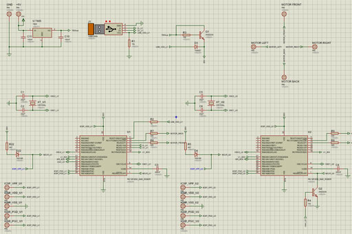
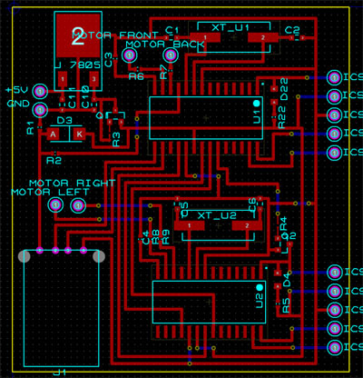
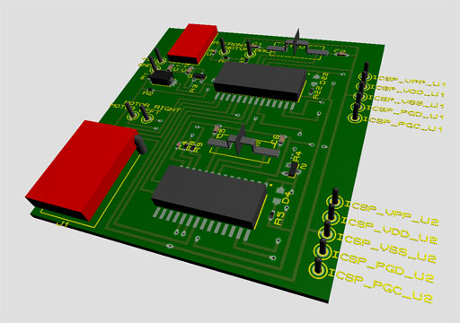

coptercontrol (BETA)
============

A drone with Android brain. 
Consist in a little external USB module plugged into a Android. This module also have PWM outputs (0v-3v) that allow connect any self-powered engines. Velocity of engines are controlled by the PWM. 
Android device, the USB module and the desired engines designates the drone, at same time other Android application in the client allowing the control of the first through the AppWarp API for communication. 
 

Materials:  
- Device with Android  
- 2 PIC 18F2550 SMD (Master SPI+USB+2PWM, SLAVE SPI+2PWM)  
 

Includes:  
- Software:  
- Android brain project using SCEJ API for 3D visualization, USB API, etc...  
 
- Firmware (pic 18F2550. XC8 v1.36):  
- Proteus & MPLABX project  
 

  
  
  
  

Changelog:  
- 1. Connection and communication between Android app and Master PIC  
- 2. Activate 2 PWM in Master according to Android gyroscope X (Front/Back) sensor data  
- 3. Connection and communication between Master and Slave throught SPI  
- 4. Activate 2 PWM in Slave according to Android gyroscope Z (Left/Right) sensor data  
- 5. Proteus schematic  
- 6. PCB & materials  
 
 
Todo´s:  
- 7. Testing with real engines (Stabilization pre-proccess. Find minor elevation forces (50%)) 
- 8. Fix stabilization accuracy (50%) using accelerometer  
- 9. Android client application for the control of the Android server (the dron brain) using AppWarp  
- Handle 3 or more detected outputs  